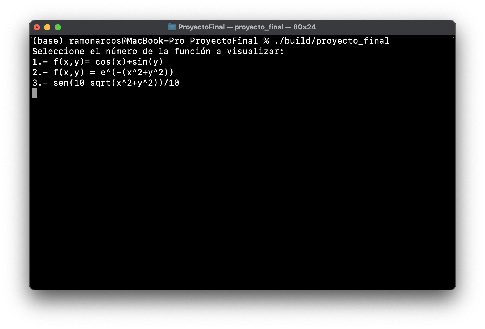
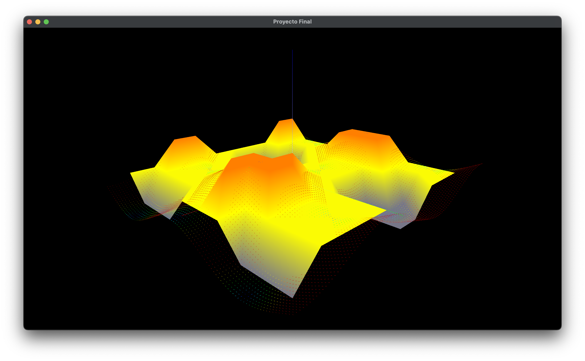
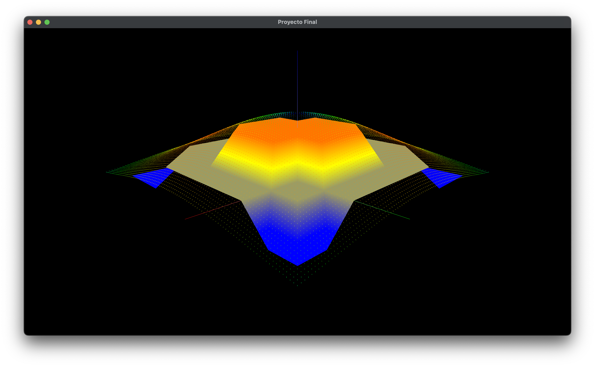
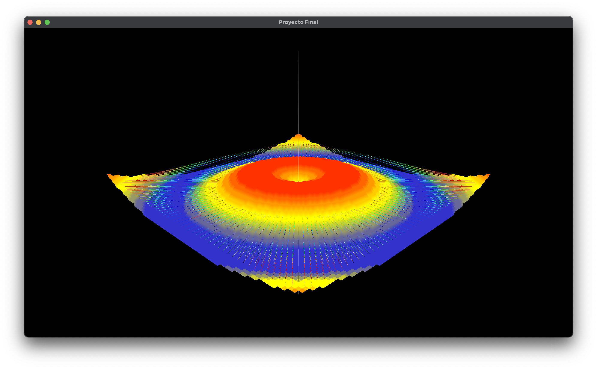
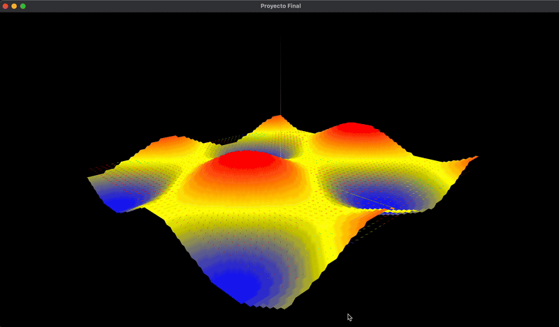
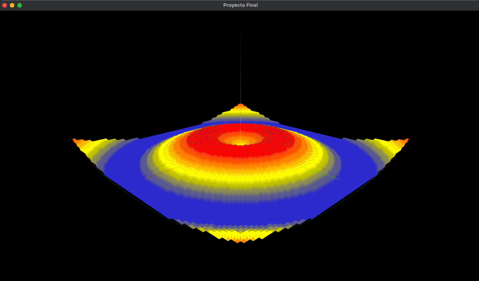
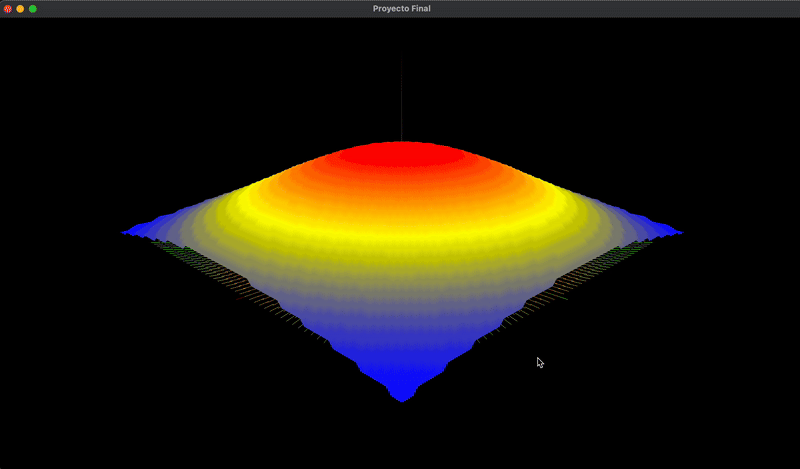

# Visualización Proyecto Final: Visualización de Vectores.
### Alumno: Ramón Arcos Morales. No.cuenta: 319541478
## Requerimientos
Para ejecutar el proyecto es necesario tener instalado [cmake](https://cmake.org),[glew](https://glew.sourceforge.net), [glfw](https://www.glfw.org)  y [glm](https://github.com/g-truc/glm). Este proyecto se basa en la siguiente [plantilla](https://github.com/diegodmag/OpenGLFundations/tree/main/templates/t_02).
## Instrucciones

Para compilar el proyecto, es necesario ejecutar lo siguiente:
```
cd ProyectoFinal
cmake -B build
cmake --build build --parallel 
```
Una vez compilado el proyecto, se ejecuta con:
```
./build/proyecto_final
```
## Características

Al ejecutar el proyecto, se visualiza lo siguiente:

Se requiere seleccionar la función a graficar. Una vez seleccionada, se tiene lo siguiente:

Para la función $f(x,y) = \cos(x)+\sin(y)$ se ve:


Para la función $f(x,y) = e^{-(x^2+y^2)}$ se ve:


Para la función $f(x,y) = \sin(10 \sqrt{x^2+y^2})\frac{1}{10}$


Se tiene consistentemente el origen coordenado, donde el eje x es de color verde, el y de color azul y el eje z de color rojo. Además, en el plano $z=0$ se visualiza el campo escalar de la función. Al seleccionar una función, se imprime su información en terminal.


Cada función puede ser visualizado como una nube de puntos (GL_POINTS), un conjunto de líneas (GL_LINES) o una superficie (GL_TRIANGLES). Para seleccionar el modo GL_POINTS se requiere pulsar la tecla P, para GL_LINES la tecla L y para GL_TRIANGLES la tecla T.



Así mismo, cada modelo puede ser ocultado para poder visualizar de mejor manera el campo escalar. Para ello se requiere mantener pulsada la tecla H.



Es posible controlar la cámara mediante las flechas del teclado. Las flechas izquierda y derecha controlan la cámara en el eje X y las flechas arriba y abajo en el eje Z. Para restablecer la cámara es necesario presionar la tecla R.



Finalmente, es posible cambiar la resolución de la malla. Es decir, se tiene la capacidad de rendereizar una mayor cantidad de puntos para obtener más información de la malla. Si se quiere aumentar la resolución es necesario oprimir la tecla S y posteriormente la tecla 1. Para disminuir la resolucón es necesario oprimir la tecla D y posteriormente la tecla 0.


El mapa de color utilizado muestra los puntos más bajos de color azul, los medios de amarillo y los más altos de rojo. Para el campo escalar se utilizó el mapa de color arcoiris, el cual muestra de colores fríos los gradientes cuya norma es menor y de cálidos la que es mayor.
